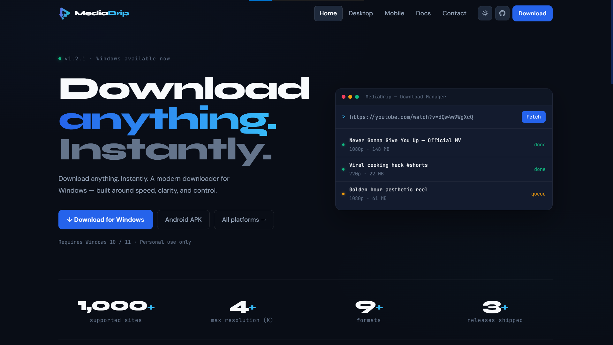
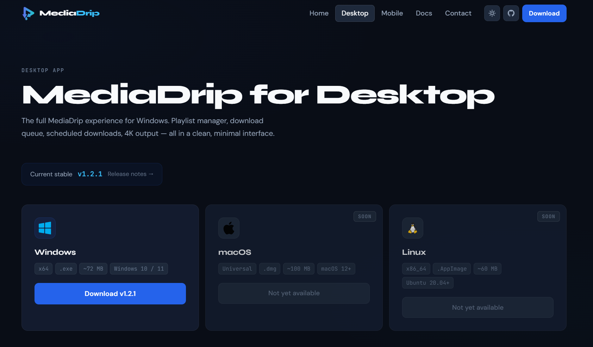
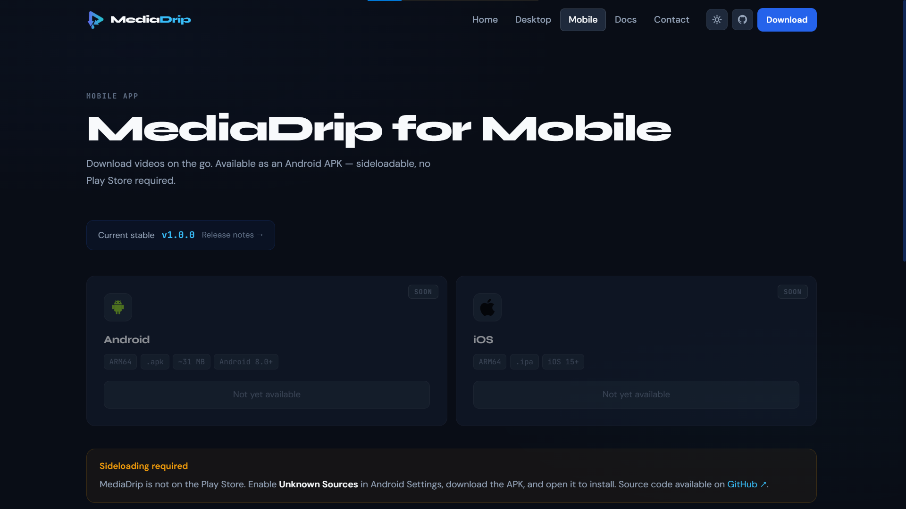
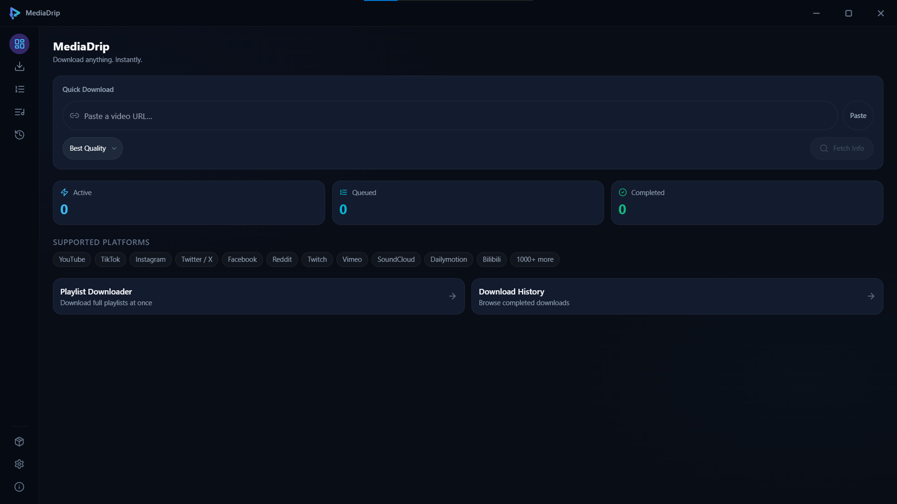
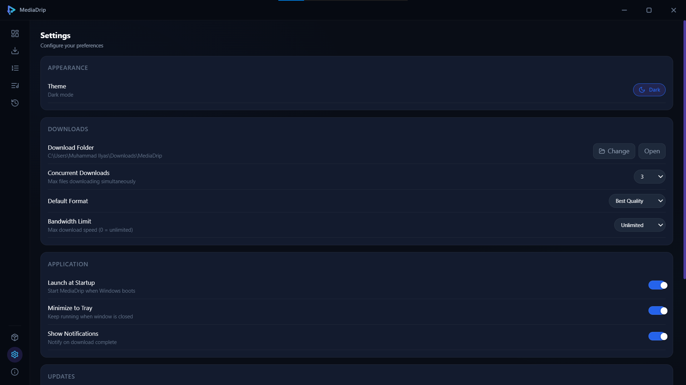
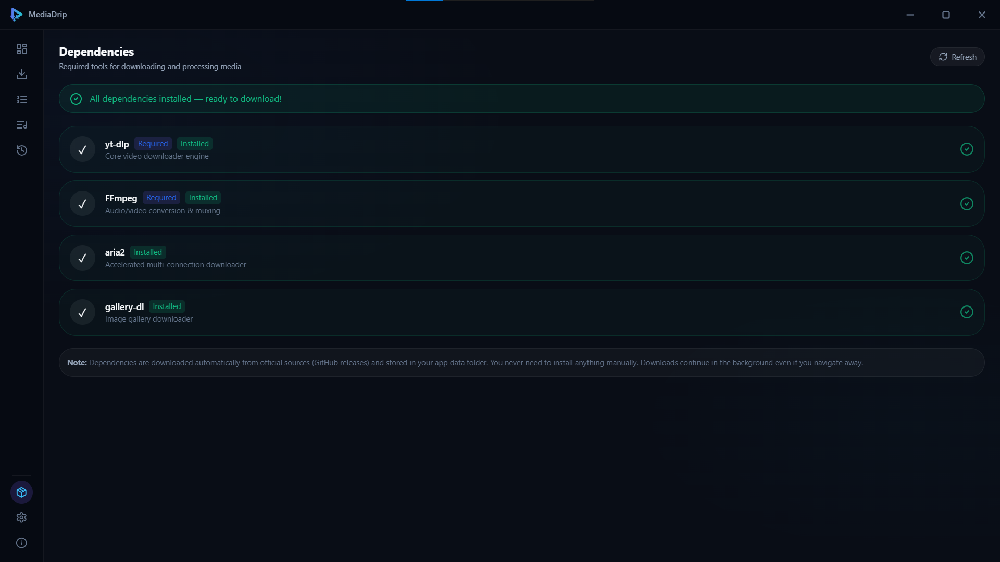

<h1>MediaDrip</h1>

A fast, clean media downloader for Windows and Android. Paste a link. Pick a format. Done.

  
  
  
  
  

---

## Website Screenshots

<table>
  <tr>
    <td></td>
    <td></td>
  </tr>
</table>

---

## Desktop App Screenshots

<table>
  <tr>
    <td></td>
    <td></td>
  </tr>
</table>

---

## Mobile App Screenshots

<!-- 

<table>
  <tr>
    <td></td>
    <td></td>
  </tr>
</table> -->

**Coming Soon**

---

## Overview

MediaDrip lets you download videos, audio, and playlists from YouTube, TikTok, Instagram, and over 1000 other sites — completely free, no account required.

Available for **Windows** and **Android**.

---

## Download

### Windows

Requires Windows 10 or 11 &nbsp;·&nbsp; 64-bit &nbsp;·&nbsp; ~78 MB

### Android

**Coming Soon**

Requires Android 8.0 or higher &nbsp;·&nbsp; ℮ 30 MB &nbsp;·&nbsp; No Play Store required

---

## Features

| | |
|---|---|
| **Lightning Fast** | Downloads run at your full network speed — no throttling, no waiting. |
| **1000+ Platforms** | YouTube, TikTok, Instagram, Twitter/X, Facebook, Reddit, Twitch, Vimeo, SoundCloud, and thousands more. |
| **4K & Audio** | Download video up to 4K in MP4 or WEBM, or extract audio as MP3 or M4A. |
| **Playlists & Queue** | Download entire playlists in one click, all in the format you choose. |
| **Scheduled Downloads** | Set downloads to run at a specific time and walk away. |
| **Dark & Light Mode** | A clean, minimal interface designed for both environments. |

---

## Installation

### Windows

1. Visit the [Desktop download page](https://mediadrip.vercel.app/desktop-app) and download the installer
2. Run the `.exe` file and follow the on-screen steps
3. Launch MediaDrip from the Start menu or desktop shortcut

### Android

1. Visit the [Mobile download page](https://mediadrip.vercel.app/mobile-app) and download the APK
2. On your device, go to **Settings → Apps → Special app access → Install unknown apps**
3. Allow your browser or file manager to install APKs
4. Open the downloaded file and tap **Install**

For detailed guides, visit the [Documentation](https://mediadrip.vercel.app/docs).

---

## Supported Sites

YouTube &nbsp;·&nbsp; TikTok &nbsp;·&nbsp; Instagram &nbsp;·&nbsp; Twitter / X &nbsp;·&nbsp; Facebook &nbsp;·&nbsp; Reddit &nbsp;·&nbsp; Twitch &nbsp;·&nbsp; Vimeo &nbsp;·&nbsp; SoundCloud &nbsp;·&nbsp; and 1000+ more

---

## FAQ

**Is MediaDrip free?**  
Yes, completely free for personal use. No subscription, no account, no hidden cost.

**Is it safe to install?**  
Yes. Security warnings from Windows Defender or browsers are false positives common with unsigned indie software. The application contains no malware.

**Why is the Android app not on the Play Store?**  
Distributing directly as an APK keeps the app free and avoids platform restrictions. It is safe to sideload.

**What output formats are supported?**  
MP4 and WEBM for video. MP3 and M4A for audio-only downloads.

**Can I download private or restricted videos?**  
MediaDrip is intended for content you have the right to access. Do not use it to download private or copyrighted content without permission.

**Where do I report a bug or get support?**  
Open an issue on [GitHub](https://github.com/root-ilyas/mediadrip/issues) or reach out via the [Contact page](https://mediadrip.vercel.app/contact).

---

## Links

| Resource | URL |
|----------|-----|
| Website | https://mediadrip.vercel.app |
| Desktop App | https://mediadrip.vercel.app/desktop-app |
| Mobile App | https://mediadrip.vercel.app/mobile-app |
| Release History | https://mediadrip.vercel.app/desktop-app/releases |
| Documentation | https://mediadrip.vercel.app/docs |
| Privacy Policy | https://mediadrip.vercel.app/privacy-policy |
| Contact | https://mediadrip.vercel.app/contact |
| GitHub Issues | https://github.com/root-ilyas/mediadrip/issues |

---

Personal use only. Only download content you have the right to access. 
Copyright &copy; 2026 Muhammad Ilyas. All rights reserved.

